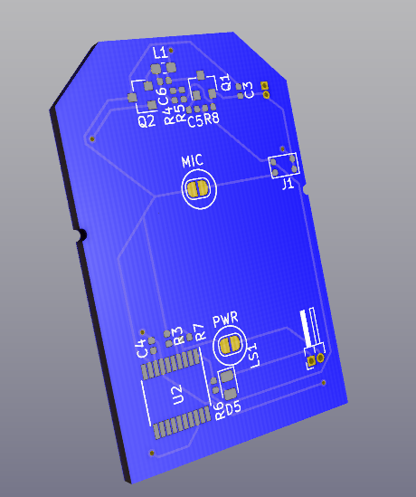

# PersonalBeacon
Personal Beacon is a key-fob sized emergency radio beacon designed to enable the location of persons trapped inside collapsed structures. While cell phones and common walkie-talkies may not be in reach during an emergency or able to make it through rubble, this beacon is small enough to carry on a keychain and utilizes the same frequencies as ground-penetrating radar allowing for one-way communication from the rubble to rescuers above.

## Why Was This Device Created?

This device was created in response to the tragedies caused by the Western Kentucky tornado where dozens of people were trapped under buildings, cars, under other debris and were unable to be recovered in time due to the inability of first responders to locate victims in the rubble.

## How It Works

When activated the personal beacon sends out an FM ping on the 30MHz frequency once per second. The beacon uses a low wattage transmitter (~1/2 watt) which operates on the police/emergency band in the U.S. (30MHz) allowing the signal to be picked up by standard issue radios. The strength of the signal is directly proportional to the distance between the receiver and beacon allowing for first responders to use their handheld radios to quickly triangulate the position of the beacon by the change in volume of the ping.

In addition to the beacon, the device embeds a MEMS microphone and a push-to-talk button enabling one-way communication from the entrapped person.

## How Long Does The Beacon Last?

The original design utilizes a pair of CR2477 batteries. The battery life is dependent on which mode the beacon is currently operating in.

### Standby Mode

Standby mode is the default mode, the microprocessor on the beacon is silently waiting for the wake-up command (on button). In standby mode, the estimated lifespan of the device is 8 years allowing you to daily carry the device without worrying about charging it. It is still recommended to replace the batteries every 3-4 years to ensure enough charge in event you need to use the beacon.

### Beacon Only

Beacon only mode is the default mode of the beacon after activation. During this time, the beacon will send out an audible pulse over the radio once per second. The beacon is expected to continue pinging for up to 17 days.

### Push To Talk

Push-to-talk mode is the mode that is entered while holding down the PTT button. The PTT mode drains the battery much faster than the beacon mode as it runs the transmitter the entire time the PTT button is held down. 

to last up to 17 days. During push-to-talk mode the device can be expected to last 12-24 hours. Additionally, charging circuitry is available for a larger (pocket-clipped) lithium-ion based beacons. The beacon is a very low wattage transmitter (~1/2 watt) which operates on the police/emergency band in the U.S. (30MHz) allowing the signal to be picked up by a handheld radio. The volume of the audible beacon on the receiver is directly proportional to the distance between the receiver and the beacon allowing first responders to use their handheld as effective dousing rods to locate entrapped persons.

## How Should This Device Be Used?

This device should be carried on your person at all times in an easy-to-reach place. In the event you become lost, stuck, or otherwise need emergency assistance (as in the case of entrapment) and you are unable to reach emergency services by any other means, you should activate beacon mode by pressing the emergency button once. It is then recommended that you use the PTT feature to send a short transmission declaring a "mayday" (international distress signal), identifying yourself, any injuries you may have, your last known location within the building, and any other pertinent information that may be beneficial to your rescue. It is recommended that you provide sparing, but repeated updates as to the situation until your rescue. Upon rescue be sure to deactivate the beacon by pressing the emergency button again, if the device fails to shut off for any reason you can simply remove the battery.

A typical emergency broadcast is structured as follows:

**MAYDAY, MAYDAY, MAYDAY**
**THIS IS** (your name)
**My location is** (address)
**I AM** (trapped, etc.)
**I REQUIRE IMMEDIATE ASSISTANCE**
**I HAVE** (number of people with you, injuries, other pertinent info)
**OVER**

An example might be:

> "Mayday, mayday, mayday, this is Noah Wood, I am trapped in building 1 at St. Johns and cannot escape. I am trapped in the waiting area there are 5 people with me, we have injured. Unable to receive. I have activated a radio beacon. OUT"

"OUT" was used in place of "OVER" as the device does not currently implement a receiver to allow two-way communications.
